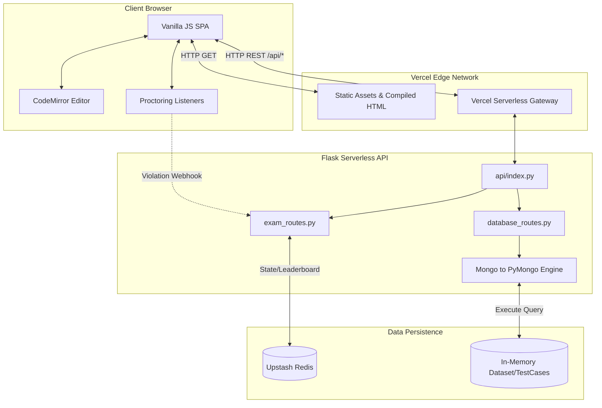

# Codexa Labs - MongoDB Web Portal 🚀

> **A professional, robust web application for evaluating and practicing MongoDB querying in a proctored environment.**

[](https://python.org)
[](https://flask.palletsprojects.com/)
[](https://vercel.com/)
[](LICENSE)

---

## ✨ Features

- **Proctored Examination Environment**: Prevent external copy-pasting and track full-screen exits.
- **Mentor Real-time Dashboard**: Live view of participant leaderboards, copy-paste violations, kicked users, and active submissions.
- **CodeMirror Integration**: In-browser code editing with syntax highlighting for MongoDB queries.
- **Robust Multi-line Copy-Paste Enforcement**: Intelligently allows copying within the application editor but heavily restricts and reports external pastes.
- **Single Page Application (SPA)**: Custom-built lightweight vanilla JavaScript framework avoiding heavy frontend dependencies.
- **Database Engine Simulator**: Compiles JS-based MongoDB queries on the backend directly into secure `pymongo` aggregations for dataset evaluation.
- **Excel Results Export**: Mentors can export the leaderboard to an `.xlsx` sheet for official records.

---

## 🏗 System Architecture

The application operates heavily on a **Stateless Serverless API Model** connected with a highly available key-value store (Redis via Upstash) for real-time exam tracking.



---

## 🧩 Core Services Detailed

### 1. The Frontend (SPA)
The frontend is compiled into a single massive index file (`public/index.html`) using a python bundling script (`embed_frontend.py`). It orchestrates multiple DOM namespaces without the overhead of React or Vue:
- **`panels.js`**: Controls the visibility of various overlay screens (Role selection, Exam Dashboard, Submission Panel).
- **`exam.js`**: Contains the majority of the business logic. Handles exam synchronization via HTTP polling, UI updates (DOM diffing), clipboard interception, fullscreen management, and API calls.

### 2. The Flask Backend (API)
The backend acts as an ephemeral execution layer hosted on Vercel Serverless Functions (`api/index.py`):
- **`exam_routes.py`**: Manages the life cycle of the examination rooms. Creates room tokens, authenticates users, receives code submissions, manages leaderboards, and logs proctoring violations.
- **`database_routes.py`**: Interacts with the dataset models.
- **Translation Engine**: Translates Javascript-like MongoDB syntax (e.g. `db.collection.find()`) securely into Python `pymongo` syntax in sandboxed contexts to run test cases.

### 3. Upstash Redis (State Management)
Because the Flask backend is serverless (stateless), Redis is used as the centralized source of truth:
- Tracks live `participants`.
- Manages the `leaderboard` scores and metrics.
- Logs `kicked` students in dictionary maps tracing kick reasons.
- Stores historical `submissions` for mentors to review.

### 4. Proctoring Subsystem
A combination of frontend EventListeners and backend Webhooks:
- Intercepts `paste` events and ensures clipboard text strictly matches text copied internally via CodeMirror's `getSelection()` APIs. Rejects external data.
- Listens to `fullscreenchange` and reports to the Mentor Dashboard immediately if the user tabs out or minimizes the window.

---

## 🚀 Quick Start (Local Development)

### Prerequisites

- Python 3.11+
- Vercel CLI (Optional but recommended for deployment testing)
- Redis Upstash URL (Environment variables)

### Setup

```bash
# Clone the repository
git clone https://github.com/prranith-swargams-projects/practice-mongodb
cd practice-mongodb

# Install dependencies
pip install -r api/requirements.txt

# Run the local vercel development server
vercel dev
```

### Build the Frontend
To bundle the frontend JavaScript, CSS, and SVG components into the deployable `index.html`:
```bash
python embed_frontend.py
```

### Deploy to Production
```bash
vercel --prod
```

---

## 🗄 Supported Query Syntax

The application translates standard MongoDB shell syntax automatically to run securely on the server:

```javascript
db.collection.find({ status: "ACTIVE" }).sort({ count: -1 }).limit(10)

db.collection.aggregate([
  { $match: { category: "ELECTRONICS" } },
  { $group: { _id: "$brand", total: { $sum: "$price" } } }
])
```

---

## 📄 License

MIT License — see [LICENSE](LICENSE).
